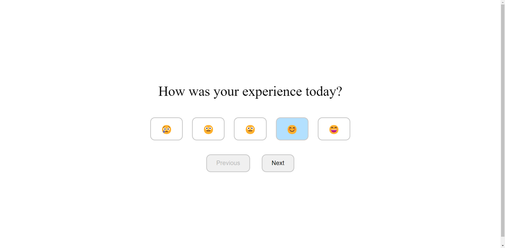

# NextFeedbackChannel

Streamlined NFC Surveys: Effortless, Elegant, and User-Friendly.

## Screenshots:
### Creating a survey for your company


### Survey for your customer


## Quick start:
```sh
docker compose up -d
deno task start
```

### Tables you need:

```sql
-- Create Business table
CREATE TABLE IF NOT EXISTS business (
    id VARCHAR(255) PRIMARY KEY,
    created_at TIMESTAMPTZ DEFAULT NOW(),
    updated_at TIMESTAMPTZ DEFAULT NOW(),
    name VARCHAR(255) NOT NULL
);

-- Create Survey table
CREATE TABLE IF NOT EXISTS survey (
    id VARCHAR(255) PRIMARY KEY,
    created_at TIMESTAMPTZ DEFAULT NOW(),
    updated_at TIMESTAMPTZ DEFAULT NOW(),
    business_id VARCHAR(255) NOT NULL,
    questions JSONB[] -- Unsure.
    FOREIGN KEY (business_id) REFERENCES business(id)
);

-- Create Feedback table (using a generic payload)
CREATE TABLE IF NOT EXISTS feedback (
    id VARCHAR(255) PRIMARY KEY,
    created_at TIMESTAMPTZ DEFAULT NOW(),
    updated_at TIMESTAMPTZ DEFAULT NOW(),
    survey_id VARCHAR(255) NOT NULL,
    payload JSONB[], -- Unsure...
    FOREIGN KEY (survey_id) REFERENCES survey(id)
);
```

### Check out the [flow](flow.md) as well!
